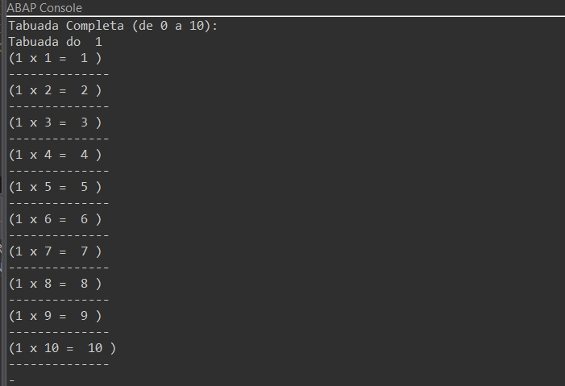
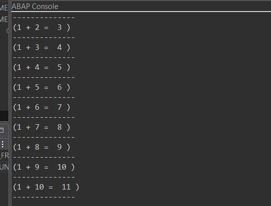
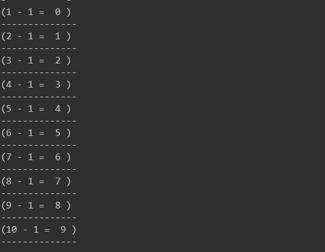
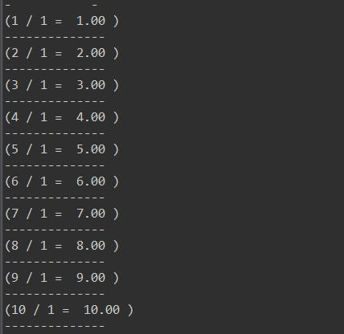

# Tabuada-Simples-em-ABAP-Cloud
Código iniciante em Abap Cloud que realiza as 4 operações básicas da matemática e retorna em console.
 
 Prezados segue abaixo o resultado em console das 4 Operações básicas da matemática.
 Atenção! foi implementado uma classe(if_oo_adt_classrun) para que fosse possível visualizarmos em console os resultados.
 
 Operação de Multiplicação
 

Operação de Adição
 

Operação de Subtração
 

Operação de Divisão
 
